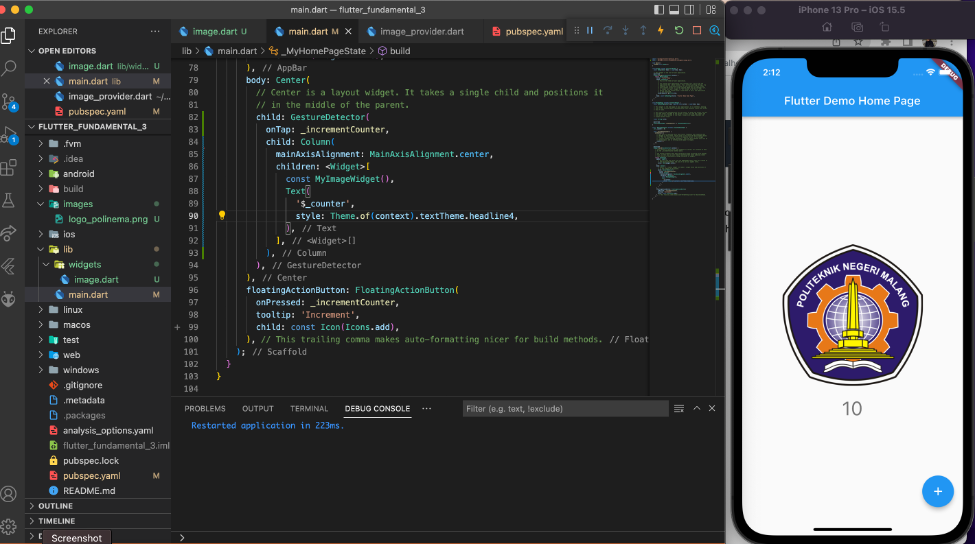
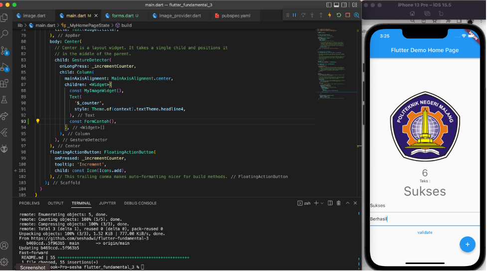

# Flutter Fundamental Bagian 3

## Praktikum 1 - Menerapkan Gesture Detector 

### Langkah 1 : Menambahkan GestureDetector

Buka file `main.dart` lalu ganti bagian `body` dengan kode berikut. Untuk `MyImageWidget()` dapat Anda ganti dengan widget sendiri.

```
body: Center(
        child: GestureDetector(
            onTap: _incrementCounter,
            child: Column(
              mainAxisAlignment: MainAxisAlignment.center,
              children: <Widget>[
                const MyImageWidget(),
                Text(
                  '$_counter',
                  style: Theme.of(context).textTheme.headline4,
                ),
              ],
            )),
      ),
```

file widget `image.dart`.

```
import 'package:flutter/material.dart';

class MyImageWidget extends StatelessWidget {
  const MyImageWidget({Key? key}) : super(key: key);

  @override
  Widget build(BuildContext context) {
    return const Image(
      image: AssetImage("logo_polinema.png"),
    );
  }
}
```

### Langkah 2 : Membuat Dokumentasi

Jika project dijalankan maka kode program pada `MyImageWidget()` disini menampilkan logo Polinema seperti gambar berikut. Jika klik/tap pada gambar, maka angka di bawah akan terus bertambah, dikarenakan pada **GestureDetector** terdapat parameter **ontap: _ incrementCounter** yang mengakses state **incrementCounter**.

Output Program 



### Langkah 3 : Eksperimen Jenis Gesture Lain

- Menggunakan `onDoubleTap`

 Action akan dijalankan ketika user melakukan tap sebanyak dua kali, berikut kode programnya.
 
```
body: Center(
        // Center is a layout widget. It takes a single child and positions it
        // in the middle of the parent.
        child: GestureDetector(
          onDoubleTap: _incrementCounter,
          child: Column(
            mainAxisAlignment: MainAxisAlignment.center,
            children: <Widget>[
              const MyImageWidget(),
              Text(
                '$_counter',
                style: Theme.of(context).textTheme.headline4,
              ),
            ],
          ),
        ),
      ),
```

- Menggunakan `onLongPress`

Action akan dijalankan ketika user melakukan tap yang ditahan. Berikut kode programnya. 

```
body: Center(
        // Center is a layout widget. It takes a single child and positions it
        // in the middle of the parent.
        child: GestureDetector(
          onLongPress: _incrementCounter,
          child: Column(
            mainAxisAlignment: MainAxisAlignment.center,
            children: <Widget>[
              const MyImageWidget(),
              Text(
                '$_counter',
                style: Theme.of(context).textTheme.headline4,
              ),
            ],
          ),
        ),
      ),
```

## Praktikum 2 : Menerapkan Input Widget dan Forms

### Langkah 1 : Buat class FormContoh 

Buatlah file baru dengan nama `forms.dart` lalu buat class FormContoh seperti kode berikut

```
class FormContoh extends StatefulWidget {
  const FormContoh({Key? key}) : super(key: key);

  @override
  _FormContohState createState() => _FormContohState();
}
```

### Langkah 2 : Buat class _FormContohState

Kemudian buat class state-nya

```
class _FormContohState extends State<FormContoh> {
  final _controller = TextEditingController.fromValue(
    const TextEditingValue(text: "Initial value"),
  );

  final _key = GlobalKey<FormFieldState<String>>();
  String _textValue = "";

  @override
  void initState() {
    _controller.addListener(() {
      setState(() {
        _textValue = _controller.text;
      });
    });
    super.initState();
  }

  @override
  Widget build(BuildContext topContext) {
    return Form(
      key: _key,
      child: Column(
        mainAxisSize: MainAxisSize.min,
        children: <Widget>[
          const Text(
            'Teks :',
          ),
          Text(
            _textValue,
            style: Theme.of(context).textTheme.headline3,
          ),
          TextFormField(
            controller: _controller,
            validator: (String? value) {
              return value == null || value.isEmpty
                  ? "Tidak Boleh Kosong"
                  : null;
            },
          ),
          TextFormField(),
          Builder(
            builder: (BuildContext subContext) => TextButton(
              onPressed: () {
                final valid = Form.of(subContext)!.validate();
                if (kDebugMode) {
                  print("valid: $valid");
                }
                if (valid) {
                  setState(() {
                    _textValue = _controller.text;
                  });
                }
              },
              child: const Text("validate"),
            ),
          )
        ],
      ),
    );
  }
}
```

### Langkah 3: Tambah Widget FormContoh di main.dart

Lalu pindah ke file main.dart dan panggil widget FormContoh tersebut yang telah dibuat.

```
children: <Widget>[
      const MyImageWidget(),
      Text(
        '$_counter',
        style: Theme.of(context).textTheme.headline4,
      ),
      const FormContoh(),
    ],
 ```
 
 Output program : 
 
 
 
 
